# QtRBAC

基于角色访问控制的Linux安全模块，QtRBAC是我给这个实现的模块自定义的一个名称。

## 1 模块介绍

Linux安全模块（LSM）是Linux内核的一个轻量级通用访问控制框架，但在内核2.6.x后，LSM模块不再运行动态加载到内核，而需要将模块编译进内核，于是需要编写Makefile以及Kconfig，除`kernel/security/demo`中的Makefile和Kconfig可以直接复制使用外，`kernel/security`中的Makefile以及Kconfig应该在当前内核源码所提供的内容上添加。

## 2 RBAC

### 2.1 RBAC

RBAC模型（`Role-Based Access Control`：基于角色的访问控制)，在RBAC中，用户不再直接与权限相连，而是通过“角色”这一属性来间接的被赋予权限，用户通过成为适当的角色来的到这些角色固有的权限，这样处理就解耦了用户与权限的关系。这就极大地简化了权限的管理。在一个组织中，角色是为了完成各种工作而创造，用户则依据它的责任和资格来被指派相应的角色，用户可以很容易地从一个角色被指派到另一个角色。角色可依新的需求和系统的合并而赋予新的权限，而权限也可根据需要而从某角色中回收。角色与角色的关系可以建立起来以囊括更广泛的客观情况。

.png)

每个用户扮演一个或多个角色（多对多），一个角色具有多种权限（多对多）。简化统一后的 模型如下：

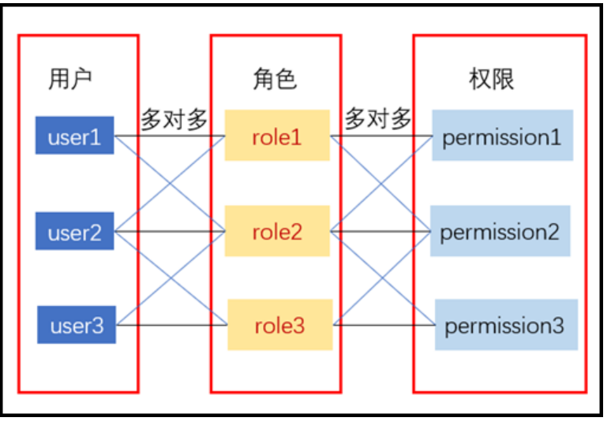

### 2.2 LSM

`LSM （Linux Security Module）`是Linux内核的一个轻量级通用访问控制框架。用户可以根据其需求选择适合的安全模块加载到Linux内核中，从而大大提高了Linux安全访问控制机制的灵活性和易用性。
LSM不干扰原先的安全策略，它通过hook技术执行增加一层（访问）控制策略，也就是在通往内核的大道上加了一个关卡，这个关卡如果没有哨兵就是空架子（对应于LSM没有加载任何安全机制）。

## 3 配置管理程序

### 3.1 菜单

直接运行程序，就会弹出菜单提示：

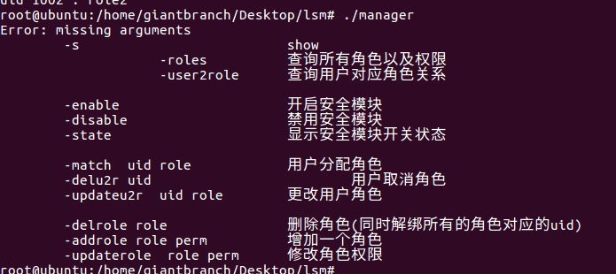

### 3.2 模块启用与关闭

通过`manager -state`可以查看模块当前的状态，如果为`Disable`，该模块不干预访问控制，当为`Enable`时才干预访问控制。通过`-enable`可以激活模块，通过`-disable`可以禁用模块

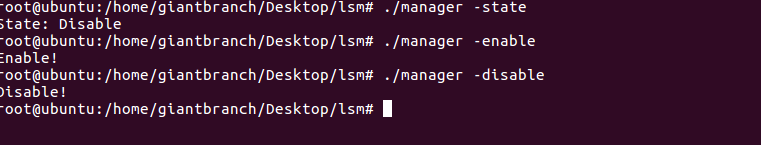


### 3.3 角色管理

#### 3.3.1 查询角色

通过`manager`进行角色管理，通过`-s`选项为显示当前的角色信息`roles`

`role1`的权限:重命名文件、创建文件、创建文件夹、删除文件夹，不能删除文件

`role3`的权限：重命名文件、删除文件、删除文件夹，不能创建文件、创建文件夹

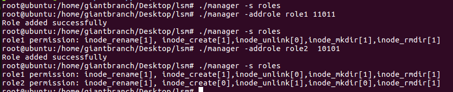

对于角色没有涉及的其他权限，采用默认DAC，该模块不做限制

#### 3.3.2 增加角色

通过`-addrole rolename perm`可以加入新的角色，其中权限的给出方式为按顺序给出该该模块针对的操作是否允许被访问，为`0`表示不允许，为`1`表示允许，该模块只是基于LSM对RBAC的简单尝试，当前只针对5个操作提供访问控制，下面创建一个对所有操作都允许的新角色`role1`和`role2`


#### 3.3.3 删除角色

`-delrole rolename`即可删除一个角色

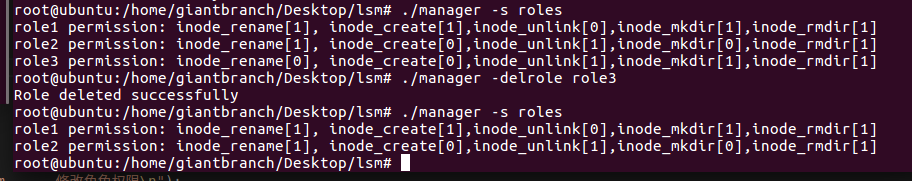

#### 3.3.4 更新角色权限

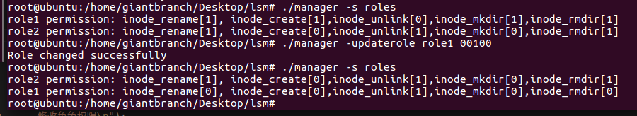

### 3.4 用户到角色

#### 3.4.1 用户角色分配

通过`-match uid rolename`可以将角色赋予到对应用户上

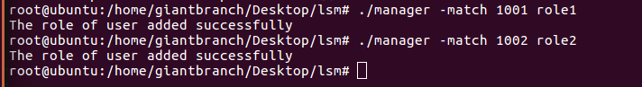

#### 3.4.2 显示用户角色分配

`-s user2role`显示用户对应的角色表

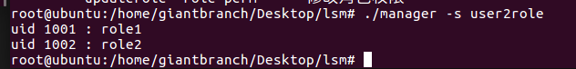

#### 3.4.3 修改用户角色分配

通过`-updateu2r uid rolename`可以更新uid用户的角色，如下将`user1`的角色更换为`role3`

为了直观，新建了一个角色`role3`用来替换

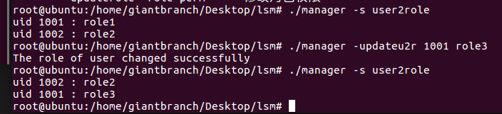

#### 3.4.4 删除用户角色分配

通过`-deluser2role uid`可以取消uid用户所分配的角色

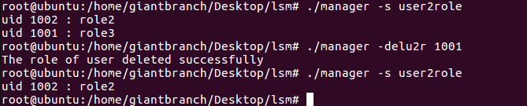


## 4 内核编译

下载内核源码linu-4.4.0:

> https://launchpad.net/ubuntu/+archive/primary/+sourcefiles/linux-lts-xenial/4.4.0-31.50~14.04.1/linux-lts-xenial_4.4.0.orig.tar.gz

将`/boot/config-'uname -r'`拷贝到源码根目录中，并重命名为`.config`，然后`make menuconfig`即可进行配置编译选项（如果失败需要`apt-get install libncurses5-dev`），对LSM而言，进入`Security options`

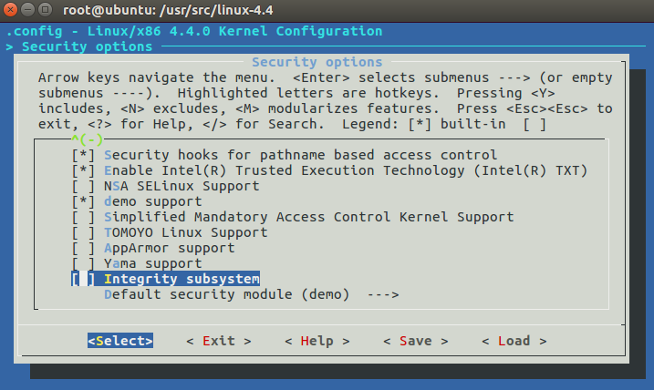

将该模块选上，而将SELinux、Yama等其他安全模块都取消，再将该模块选为默认安全模块

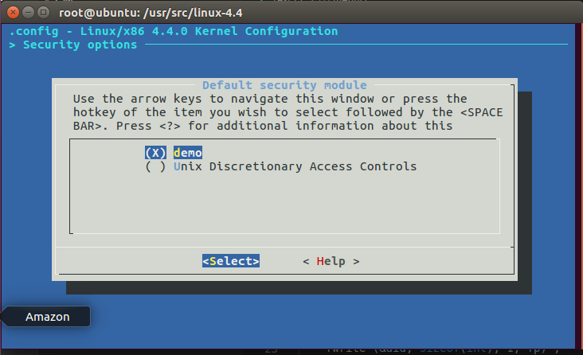

接着即可编译内核：
`make bzImage -j8 `                                  漫长

 `make modules -j8 `								漫漫长

`make modules_install `

` make install`
重启，按shift进入grub界面，选择我们的内核：

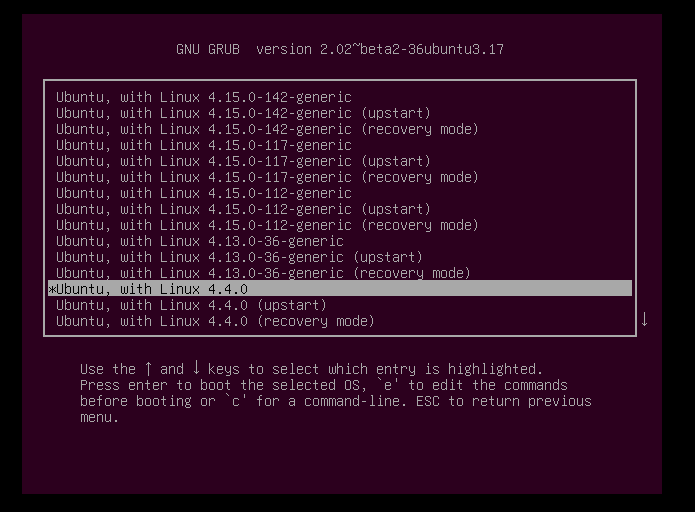

新的安全模块即可生效：此处是因为我在代码中，编写每个hook函数 的时候，将函数体复制粘贴过去，疏忽了提示信息的对应修改，在编译内核生成好了之后才发现，但是由于编译内核时间**过长**，因此就没有二次修改编译了。

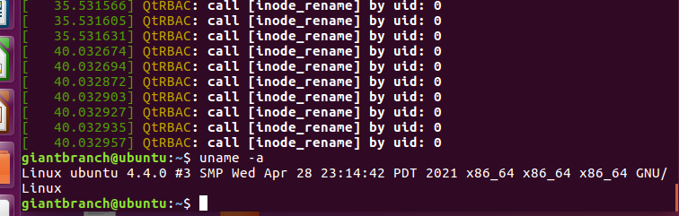


## 5 安全策略

### 5.1 用户列表

创建用户：`useradd -m user1`

设置密码： `passwd user1`

切换用户：`su - user1`

删除一个角色：`userdel -r user1`

设置了两个用户：`user1/user1` ,`user2/user2`

```c
giantbranch@ubuntu:~/Desktop/lsm$ id user1
uid=1001(user1) gid=1001(user1) groups=1001(user1)
giantbranch@ubuntu:~/Desktop/lsm$ id user2
uid=1006(user2) gid=1006(user2) groups=1006(user2)
giantbranch@ubuntu:~/Desktop/lsm$ 
```

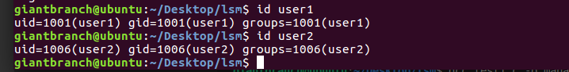

###  5.2 角色列表

创建了两个角色：`role1`和`role2`

```c
root@ubuntu:/home/giantbranch/Desktop/lsm# ./manager -s roles
role1 permission: inode_rename[0], inode_create[0],inode_unlink[1],inode_mkdir[0],inode_rmdir[0]
role2 permission: inode_rename[1], inode_create[1],inode_unlink[0],inode_mkdir[1],inode_rmdir[1]
```

### 5.3 用户角色匹配

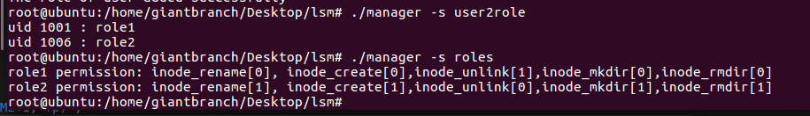

`user1`与`user2`的权限是相反的。

## 6 运行测试

### 6.1 关闭安全模块

在关闭安全模块时，对用户的权限限制并不生效：

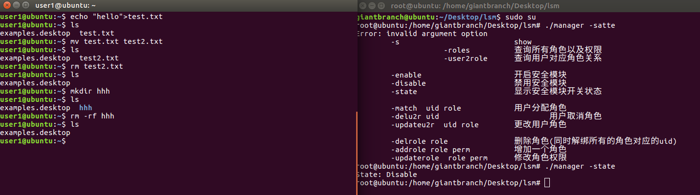


###  6.2 开启安全模块

#### 6.2.1 user1权限

role1的权限：不能重命名文件，不能创建文件，能删除文件，不能创建目录，不能删除目录

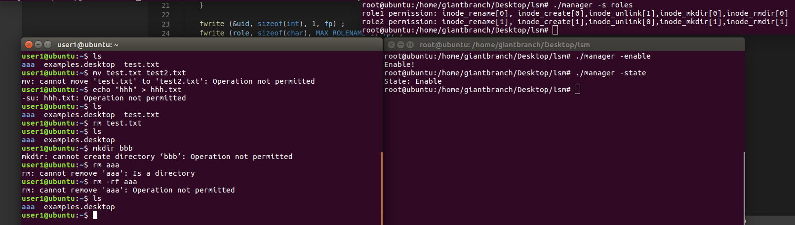

由结果可以看见，user1的权限在控制范围之内

#### 6.2.2 user2权限

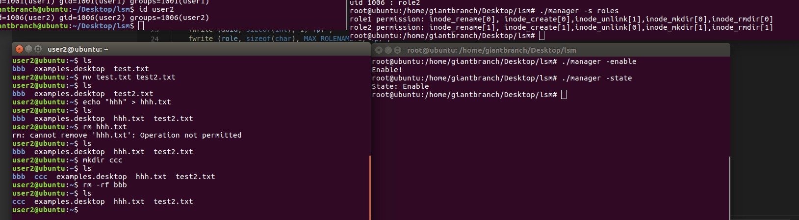

结果 可以看见，user2,的权限在控制范围之内

## 7 代码分析

### 7.1 安全模块QtRBAC

#### 7.1.2 安装钩子

钩取对对象的操作，并安装钩子。

```c
void __init demo_add_hooks(void){
    pr_info("QtRBAC: LSM LOADED!\n");//打印进入信息 dmesg | grep demo查看
    security_add_hooks(demo_hooks,ARRAY_SIZE(demo_hooks)); //添加安全没模块
}
static __init int demo_init(void){
    demo_add_hooks();
    return 0 ;
}
security_initcall(demo_init);
```

相关操作权限：

```c
static struct security_hook_list demo_hooks[] = {
    LSM_HOOK_INIT(inode_rename,rbac_inode_rename),//文件重命名
    LSM_HOOK_INIT(inode_create,rbac_inode_create),//文件创建
    LSM_HOOK_INIT(inode_unlink,rbac_inode_unlink),//文件删除
    LSM_HOOK_INIT(inode_mkdir ,rbac_inode_mkdir),//目录创建
    LSM_HOOK_INIT(inode_rmdir ,rbac_inode_rmdir),//目录删除
};
```


#### 7.1.3 操作权限控制

以：`rbac_inode_rmdir`为例，获得uid然后继续权限检查

```c
int rbac_inode_rmdir(struct inode *inode, struct dentry *dentry){
    int uid = current->real_cred->uid.val ;
	printk ("QtRBAC: call [inode_rmdir] by uid: %d\n", uid) ;
	return permission_check (uid, 4);
}
```

#### 7.1.4 权限检查流程

系统用户，是否开启安全模块，是否分配角色，若分配角色则按照角色权限控制：

```c
int permission_check (int uid, int op)
{
	char role[MAX_ROLENAME+1] ;
	
	if (uid <= 999)//系统用户直接过,系统用户直接拥有权限
		return 0 ;
	
	if (!is_enable())//模块是否开启，未开启模块直接拥有权限
		return 0 ;

	if (get_role (uid, role) != 1)//获得用户角色：获得用户角色不成功，或者说不存在相对于的角色，则直接拥有权限
		return 0 ;

	if (role_permission (role, op) == 0)//获得对应权限，权限位为0，则不拥有权限
		return -1;//-1 负数

	return 0 ;
}
```

#### 7.1.5 角色权限检查

转化为对配置文件中权限的按位检查，为1则拥有权限，为0则没有权限。

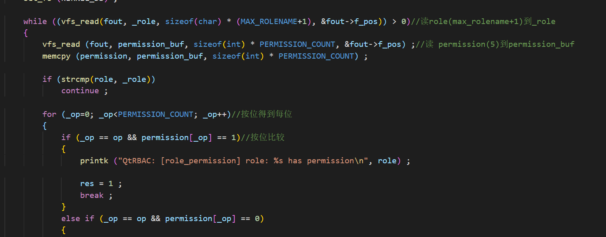


#### 7.1.6 配置文件

包含3个配置文件：

```c
#define USER2ROLE_PATH "/etc/demo/user2role"   	//content: uid(int)role(max_rolename+1) 
#define ROLES_PATH "/etc/demo/roles"			//role(max_rolename+1)permission(5)
#define CONTROL_PATH "/etc/demo/control" 		//content: state（int）
```

第一个配置文件：`/etc/demo/user2role` 中包含了每个用户(`uid`)对应的角色`role`

第二个配置文件：`/etc/demo/roles`包含了每个`role`对应的权限`perm`

第三个配置文件：`/etc/demo/control`包含了对模块的控制，打开`enable`或禁用`disable`

#### 7.1.7 钩子函数的参数

linux内核中关于LSM hook的操作，具有详细的说明，每个函数的的参数和函数执行的含义。

> https://elixir.bootlin.com/linux/latest/source/include/linux/lsm_hooks.h

### 7.2 配置管理程序

配置管理程序，来管理安全模块、角色、用户角色分配

通过对配置文件的操作，来达到配置管理的目的。

## 8 参考文献

[1].https://elixir.bootlin.com/linux/latest/source/include/linux/lsm_hooks.h

[2].https://blog.csdn.net/u010994304/article/details/50265681

[3].https://blog.csdn.net/qq_37960324/article/details/83023315

[4].https://blog.csdn.net/jnq624847569/article/details/88561123

[5].https://blog.csdn.net/jmh1996/article/details/88935907

[6].https://www.cnblogs.com/0xJDchen/p/6040446.html

[7].https://forum.radxa.com/t/drivers-error-trying-to-compile-kernel/2463

[8].https://github.com/avk7vk/RBAC-LSM

[9].https://blog.csdn.net/jmh1996/article/details/88935907?utm_medium=distribute.pc_relevant.none-task-blog-baidujs_title-9&spm=1001.2101.3001.4242

[10].https://launchpad.net/ubuntu/+archive/primary/+sourcefiles/linux-lts-xenial/4.4.0-31.50~14.04.1/linux-lts-xenial_4.4.0.orig.tar.gz

[11].https://github.com/guomo233/LSM-based-RBAC
